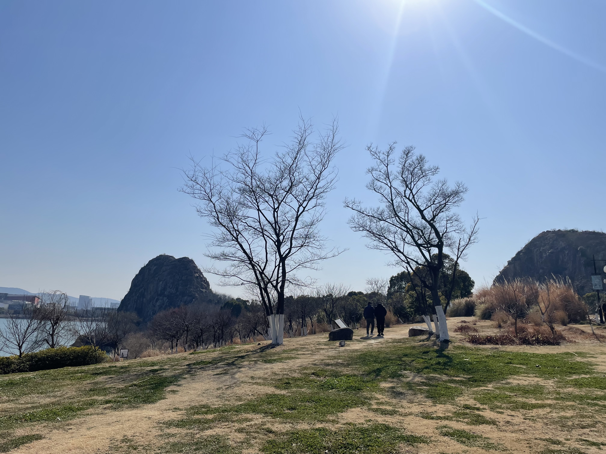

# 寿桃湖

今天是年后的第一个休息日，早上睡了一个懒觉，起来后和老婆吃了一点东西，然后就在家无聊没事做。快到中午吃饭的时候，我们打算骑着电瓶车去旺客来（一家类似社区餐厅的吃饭的地儿）吃饭，饭后去寿桃湖溜达溜达。

今天天气不错，阳光明媚，可惜有点风骑着电瓶车还是挺冷的，但是不能阻止出去溜达的心情。路上我俩就在讨论，以后小孩的近视问题。结论是：多去户外活动，这样眼睛就不容易近视（一直在户内的活动是无法让眼睛得到充分的放松和休息的），要是有点近视也不要随便戴眼镜，去内蒙逛逛可能就好了。

下面是我们在寿桃湖用手机拍的一部分照片。蓝蓝的天，绿绿的水，松软的草地和慢节奏的人儿。

寿桃湖公园中最大的一个湖

从天平山方向进入公园的入口处的一个小湖

有人在放风筝，可惜风筝有点大和丑，哈哈。

路灯有点意思，这个路直通公园的两个入口。

应该是今天天气冷的原因，来公园的人不是很多。

经历了寒冬的蒹葭，看起来还挺有荒野的感觉。😊

