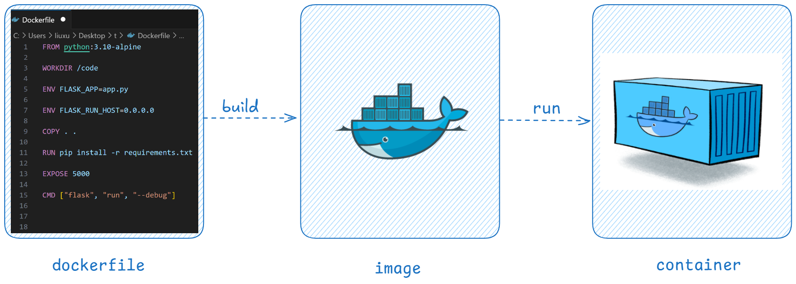

# Dockerfile

**Dockerfile 是一个文本文件，用于构建镜像**。Dockerfile 中包含了一条条的指令（Instruction），每一条指令构建一层，因此每一条指令的内容，就是描述该层应当如何构建。
Dockerfile 中的指令不区分大小写，但是为了可读性，建议使用大写。Dockerfile 中的指令按照从上到下的顺序执行。



比如：基于 Nginx 构建一个自己的镜像，在家目录下面新建 `test.txt`，字符串 `hello docker` 保存在这个文件中。

~~~dockerfile
FROM nginx
RUN cd && touch a.txt && echo 'hello docker' > test.txt
~~~

然后就可以使用 `docker build` 命令来构建镜像了。

```bash
docker build -t my-nginx:v1 -f Dockerfile .

# 查看镜像
[root@VM-12-14-centos ~]# docker images
REPOSITORY   TAG       IMAGE ID       CREATED         SIZE
my-nginx1    v1        b629454734f6   4 minutes ago   188MB
nginx        latest    5ef79149e0ec   2 weeks ago     188M
```

其中，

- 参数 `-t` 用来设置新镜像的名字和版本，如果不指定版本则默认是 `latest`
- 参数 `-f` 用来指定使用哪个文件来构建镜像，默认使用当前路径下面的名为 `Dockerfile` 或 `dockerfile` 的文件，即这种情况下打包镜像可以不使用参数 `-f`。一般这个文件约定俗成就是 `Dockerfile`。
- 最后的 `.` 表示当前目录。

因此，如果当前文件夹下面的 `Dockerfile` 名字是 `my-dockerfile`，想要打包镜像的名字是 `my-nginx`，版本是最新版本，则可以

~~~bash
[root@VM-12-14-centos ~]# ls
my-dockerfile

# 打包镜像
[root@VM-12-14-centos ~]# docker build -t my-nginx -f my-dockerfile .
...

# 查看镜像列表
[root@VM-12-14-centos ~]# docker images
REPOSITORY   TAG       IMAGE ID       CREATED          SIZE
my-nginx     latest    b629454734f6   15 minutes ago   188MB
nginx        latest    5ef79149e0ec   2 weeks ago      188MB
~~~


<br>

# Dockerfile 常用指令 

**FROM**：指定基础镜像，必须为 Dockerfile 文件的第一条指令

```bash
FROM <image>[:<tag>]
```

<br>

**RUN**：**用于在构建镜像时执行一些 linux 命令**，比如新建文件夹或安装工具等。

~~~bash
RUN  apt-get update && apt-get install -y vim
~~~

<br>

**WORKDIR**：用于指定工作目录。

~~~bash
WORKDIR /root
~~~

>注意：可以使用多个`WORKDIR`指令，但是只有最后一个指令生效。多个`WORKDIR`指令时后面的指令值可以是前面指令值的相对路径。

<br>

**ENV**：用于设置环境变量。

~~~bash
ENV <key>=<value> ...
~~~

- 可以一次设置一对，也可以同时设置多个键值对，空格间隔即可。

~~~bash
ENV MY_NAME="liuxu"
ENV MY_cat=喵咪
ENV MY_DOG='dahuang' MY_FISH='fish'
~~~

>注意：ENV 设置环境变量时也可以使用如下格式，但是此语法不支持批量设置
>
>~~~bash
>ENV <key> <value>
>~~~

<br>

**COPY**：用于将本地文件拷贝到镜像中，有两种使用方式。

~~~bash
COPY [OPTIONS] <src> ... <dest>
COPY [OPTIONS] ["<src>", ... "<dest>"]
~~~

- 当路径路中包含空格时只能使用方式2

~~~dockerfile
FROM nginx
WORKDIR /root
COPY test.txt /root/test.txt
COPY ["hello world.txt", "hello-world.txt"]
~~~

<br>

**ADD**：用于将文件拷贝到镜像中，源文件可以是URL或者本地文件，也可以是一个压缩文件（自动解压）。

- `ADD` 和 `COPY` 的功能和用法都非常相似，只是多了一些特性，比如只是网上下载文件，自动解压缩文件等。

~~~dockerfile
FROM nginx
WORKDIR /root
ADD test.txt /root/test.txt
ADD main.zip main
ADD nginx-1.27.1.tar.gz nginx
~~~

>注意：ADD 自动解包的格式有：`gzip`, `bzip2` or `xz，并且是本地的压缩包，如果是从远程URL的压缩包不会解压，但是会下载到指定路径。

<br>

**EXPOSE**：暴露端口，用于指定容器运行时监听的端口，但它并不会使得该端口对外部可见。`EXPOSE`指令只是一个声明，告知外部世界容器内部的应用程序使用了哪些端口，但是要使这些端口可访问，还需要在运行容器时使用 `-p` 参数来发布这些端口，或者在`docker-compose.yml`文件中配置相应的映射。 

```dockerfile
FROM nginx
WORKDIR /root
EXPOSE 100
```

按照这个 dockerfile 构建的镜像，使用 `docker image inspect` 可以查看到被暴露的端口号。

<br>

**VOLUME**：用于声明数据卷，实现数据持久化、容器间数据共享以及简化容器数据管理。**在 Dockerfile 中指定数据卷后，数据卷不会保存在镜像中，而是在创建容器时把这个路径自动挂载到宿主机上的某个路径下**。另外，`docker run -v` 创建容器时也可以指定其他挂载卷。

~~~dockerfile
FROM nginx
WORKDIR /root
EXPOSE 100
VOLUME /volume1
~~~

运行容器时会自动创建数据卷并挂载。

~~~bash
# 构建镜像
docker build -t my-nginx:volume .

# 运行容器
docker run -d --name my-nginx-volume my-nginx:volume

# 查看容器，找到宿主机上数据卷的路径
docker inspect <container-id>
"Mounts": [
    {
      "Type": "volume",
      "Name": "d0501b......4a7e7a2673",
      "Source": "/var/lib/docker/volumes/d050...673/_data",
      "Destination": "/myvolume1",
      "Driver": "local",
      "Mode": "",
      "RW": true,
      "Propagation": ""
    }
],
~~~

<br>

**CMD**：指定运行容器时默认被执行的命令，每个 Dockerfile 中只能有一条 CMD 指令，如果有多条，则只有最后一条会生效；

```bash
CMD command param1 param2
CMD ["executable","param1","param2"]
```

通过 `CMD` 指定的命令可以在 `docker run ` 是被替换掉。

~~~dockerfile
FROM nginx
WORKDIR /root
CMD ls /
~~~

构建镜像后，运行容器时会打印 `/` 下的文件列表，但是可以提供临时命令将其覆盖掉。

~~~bash
docer run --rm my-nginx:ls ls /var
~~~

>注意：不要混淆 `RUN` 和 `CMD`。`RUN` 是在构建镜像时执行的命令并将执行结果构建在镜像中；`CMD` 在构建时不执行任何操作，是为镜像创建容器时指定默认的命令。

<br>

**ENTRYPOINT**：用于把容器配置成可执行程序，每个Dockerfile中只能有一条ENTRYPOINT指令，如果有多条，则只有最后一条会生效；

~~~dockerfile
FROM nginx
WORKDIR /root
ENTRYPOINT ls /
~~~

构建镜像后，运行容器时会打印 `/` 下的文件列表，此时提供临时命令不会覆盖 `ENTRYPOINT` 自定义命令。

<br>

**CMD 和 ENTRYPOINT 配合**

基于两者的特点（`ENTRYPOINT`配置的命令不会被覆盖，`CMD` 配置的命令可以被覆盖），我们可以用 `ENTRYPOINT` 配置容器启动时执行的命令，使用 `CMD` 提供该命令执行时的默认参数。如此一来，启动程序就变动非常灵活。

~~~dockerfile
FROM nginx
ENTRYPOINT ["ls"]
CMD ["/"]
~~~


<br>

# Dockerfile 最佳实践

> 推荐参考官网原文：https://docs.docker.com/build/building/best-practices/

- 选择合适的基础镜像
- 固定基础镜像版本
- 构建镜像时使用 `--no-cache` 避免缓存
- 使用 `.dockerignore` 提高构建速度减少镜像大小
- 不要安装不需要的包
- 应用解耦
- 对多行参数进行排序
- 使用`RUN apt-get update && apt-get install -y` 确保您的 Dockerfile 安装最新的软件包版本，无需进一步编码或手动干预。


<br>

# 构建有网络工具的 nginx 镜像

**debian.sources**

~~~text
Types: deb
URIs: http://mirrors.tencentyun.com/debian-security
Suites: bookworm-security
Components: main
Signed-By: /usr/share/keyrings/debian-archive-keyring.gpg

Types: deb
URIs: http://mirrors.tencentyun.com/debian
Suites: bookworm bookworm-updates bookworm-backports
Components: main contrib non-free non-free-firmware
Signed-By: /usr/share/keyrings/debian-archive-keyring.gpg
~~~

>注意：因为是在腾讯云服务器上，直接使用腾讯云内网地址：http://mirrors.tencentyun.com，否则的话需要使用公网的地址：https://mirrors.cloud.tencent.com/


**Dockerfile**

~~~dockerfile
FROM nginx
COPY debian.sources /etc/apt/sources.list.d/debian.sources
RUN apt-get clean all && apt-get update && apt-get install -y \
    iproute2 \
    iputils-ping \
    vim
~~~


**Dockerfile.feat**

~~~dockerfile
FROM debian as builder
RUN --mount=type=bind,source=./debian.sources,target=/etc/apt/sources.list.d/debian.sources \
    apt-get clean all && apt-get update && apt-get install -y \
    iproute2 \
    iputils-ping \
    vim
~~~


**构建镜像**

~~~bash
docker build -t my-nginx:v1 -f Dockerfile --no-cache .
docker build -t my-nginx:v2 -f Dockerfile.feat --no-cache .


[root@VM-12-14-centos tmp]# docker images
REPOSITORY   TAG       IMAGE ID       CREATED              SIZE
my-nginx     v2        808582dfc666   About a minute ago   193MB
my-nginx     v1        4d0f7644efa4   About a minute ago   255MB
nginx        latest    5ef79149e0ec   2 weeks ago          188MB
[root@VM-12-14-centos tmp]# 
~~~

小小的优化就可以明显减少了镜像的体积

>参考官方文档：https://docs.docker.com/reference/dockerfile/#run


<br>

# 构建 flask 项目的镜像

**app.py**

~~~python
from flask import Flask


app = Flask(__name__)


@app.route('/')
def hello():
    return 'Hello World!~'                       
~~~

**requirements.txt**

~~~tex
flask
~~~

**Dockerfile**

~~~dockerfile
FROM python:3.10-alpine
WORKDIR /code
ENV FLASK_APP=app.py FLASK_RUN_HOST=0.0.0.0
COPY . .
RUN pip install -r requirements.txt
EXPOSE 5000
CMD ["flask", "run", "--debug"]
~~~

**构建镜像**

~~~bash
docker build -f Dockerfile -t flask-app:v1 --no-cache .
~~~

**运行容器**

~~~bash
docker run -f --rm --name app -p 5000:5000 flask-app:v1
~~~

**访问服务**

~~~bash
curl http://127.0.0.1:5000/
~~~

